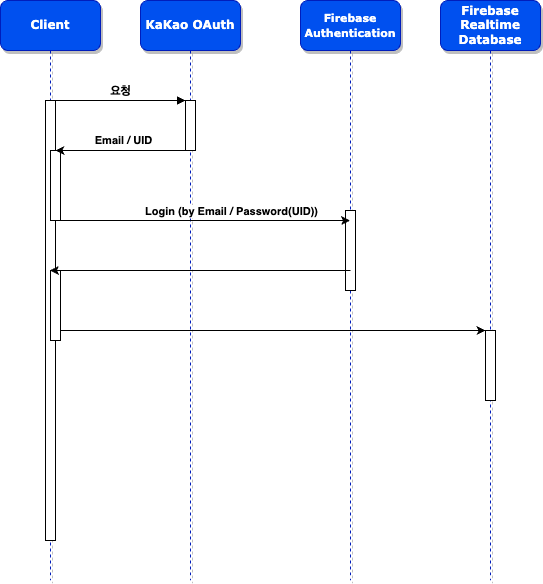

# MapMyMates

MapMyMates: 내 친구들의 지도 - GoogleMap, GPS(FusedLocationClient), Kakao Auth SDK, Firebase Realtiem
Database, Firebase Auth, Glide, Lottie Animation, View Animation



## 1. Google Map

https://developers.google.com/maps/documentation/android-sdk/overview?hl=ko

마커, 다각형, 오버레이를 지도에 추가하여 지도 위치에 대한 정보를 추가로 제공하거나 사용자 상호작용을 지원할 수도 있다.

## 2. GPS (FusedLocationClient)

- `ACCESS_FINE_LOCATION`
- `ACCESS_COARSE_LOCATION`
- FusedLocationClient
- requestLocationUpdates: 현재 위치
- lastLocation: 마지막 위치

### 위치 업데이트 요청: requestLocationUpdates

> 앱은 위치 업데이트를 요청하기 전에 위치 서비스에 연결하여 위치를 요청해야 합니다. 위치 설정 변경 과정에서는 이러한 작업을 실행하는 방법을 보여줍니다. 위치 요청이
> 완료되면 `requestLocatioUpdates()`를 호출하여 정기 업데이트를 시작할 수 있습니다.
>
> 요청 상식에 따라 통합 위치 정보 제공자는 `LocationCallback.onLocationResult()` 콜백 메서드를 호출하고 이 메서드에 `Location` 객체의
> 목록을 전달하거나 확장된 데이터에 위치가 포함되어 있는 `PendingIntent`를 실행합니다. 업데이트의 정확성과 빈도는 요청한 위치 정보 엑세스 권한과 위치 요청 객체에
> 설정한 옵션의 영향을
> 받습니다. [Android Developer](https://developer.android.com/training/location/request-updates?hl=ko)

```kotlin
override fun onResume() {
    super.onResume()
    if (requestingLocationUpdates) startLocationUpdates()
}

private fun startLocationUpdates() {
    fusedLocationClient.requestLocationUpdates(
        locationRequest,
        locationCallback,
        Looper.getMainLooper()
    )
}
```

- 로케이션을 업데이트하는 과정은 포그라운드에서 진행되기 때문에 `onResume()`일 때 `startLocationUpdates()`를 호출한다.

```kotlin
override fun onPause() {
    super.onPause()
    stopLocationUpdates()
}

private fun stopLocationUpdates() {
    fusedLocationClient.removeLocationUpdates(locationCallback)
}
```

- 반대로 onPause()일 때 위치 업데이트를 중지할 지 여부를 고려할 수 있다. 백그라운드에서 실행 중일 때에는 앱이 정보를 수집할 필요가 없는 경우 위치 업데이트를 중지하는
  것으로 전력 소모를 줄일 수 있다.

#### LocationRequest

> 앱에서 위치를 요청하거나 권한 업데이트를 수신해야 한다면 기기는 GPS 또는 Wi-Fi 검색과 같은 적절한 시스템 설정을 사용해야 합니다. 앱은 서비스(예: 기기의 GPS)를
> 직접 사용 설정하기보다는 필요한 수준의 정확성/전력 소비 및 원하는 업데이트 간격을 지정하고 기기는 시스템 설정을 자동으로 적절하게 변경합니다. 이러한 설정은
> `LocationRequest` 데이터 객체에서 정의합니다

#### **업데이트 간격**을 설정해야 하는 이유

1. **배터리 소모 최소화**: 위치 정보를 너무 자주 요청하면 스마트폰의 배터리 소모가 빠르게 진행된다. 업데이트 간격을 적절하게 설정하여 배터리 사용을 최적화해야 한다.
2. **정확도와 응답 시간의 균형**: 위치 정보의 정확도와 응답 시간은 서로 상충하는 관계가 있다. 위치 업데이트 간격을 늘리면 정확도는 떨어지지만 응답 시간이 빨라지며, 간격을
   줄이면 정확도는 높아지지만 응답 시간이 느려진다. 이러한 trade-off를 고려하여 애플리케이션의 요구 사항에 맞는 적절한 업데이트 간격을 설정해야 한다.
3. **네트워크 트래픽 관리**: 위치 정보를 너무 자주 요청하면 네트워크 트래픽이 증가하고, 서버에 부담을 줄 수 있다. 업데이트 간격을 조절하여 네트워크 트래픽을 최소화해야 할
   것이다.
4. **사용자 경험 개선**: 애플리케이션의 사용 목적에 따라 위치 정보 업데이트 간격이 다를 수 있다. 예를 들어, 걷기와 관련된 애플리케이션은 위치 정보를 자주 업데이트해야 정확한
   정보를 제공할 수 있지만, 일반적인 날씨 애플리케이션은 그렇게 자주 업데이트할 필요가 없을 것이다. 사용자 경험을 개선하려면 애플리케이션의 사용 목적에 맞는 업데이트 간격을
   설정해야 한다.

## 3. Kakao Auth SDK

https://developers.kakao.com/docs/latest/ko/kakaologin/common

- 카카오 로그인을 이용한 OAuth 로그인 구현
- 비밀번호를 제공하지 않고, 다른 웹사이트 상의 정보에 대해 접근 권한을 부여할 수 있는 공통적인 수단으로 사용되는 접근 위임을 위한 개방형 표준
- 구글 로그인, 페이스북 로그인, 카카오톡 로그인, 애플 로그인 등이 이에 해당, OAuth 로그인을 통해 발급 받은 토큰을 통해 해당 서버에서 부여받은 권한에 따른 정보 습득

### OAuth

OAuth(Open Authorization)는 인터넷 사용자들이 웹 사이트나 애플리케이션에 대한 자원에 접근할 수 있는 권한을 부여하는 개방형 표준. 이 프로토콜은 사용자가
자신의 계정 정보를 직접 공유하지 않고도, 서로 다른 서비스 제공자간에 정보를 공유할 수 있도록 돕는다.

- 이렇게 하면 개인정보의 노출을 최소화하면서도 서로 다른 서비스 제공자간에 데이터를 안전하게 공유할 수 있다.
- 리소스 소유자(Resource Owner): 사용자가 웹 사이트나 애플리케이션에 접근 권한을 부여하는 사람.
- 클라이언트(Client): 리소스 소유자의 정보에 접근하려는 애플리케이션.
- 리소스 서버(Resource Server): 리소스 소유자의 계정 정보를 저장하고 있는 서버.
- 인증 서버(Authorization Server): 인증 및 권한 부여 과정을 처리하는 서버. 이 서버는 클라이언트가 사용자의 정보에 접근할 수 있는 토큰을 발급한다.

## 4. Firebase Realtime Database

## 5. Firebase Auth

## 6. Glide

## 7. Lottie Animation

## 8. View Animation